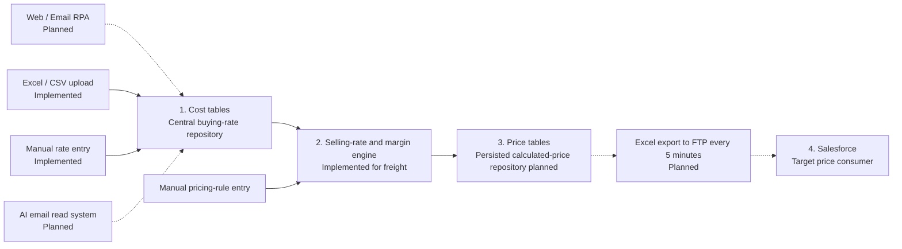
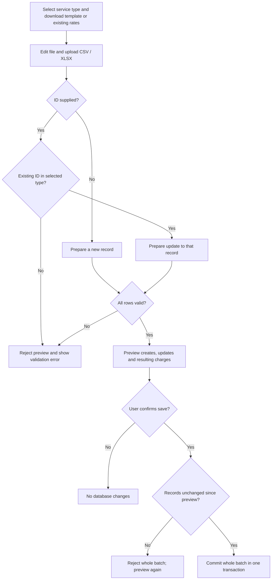
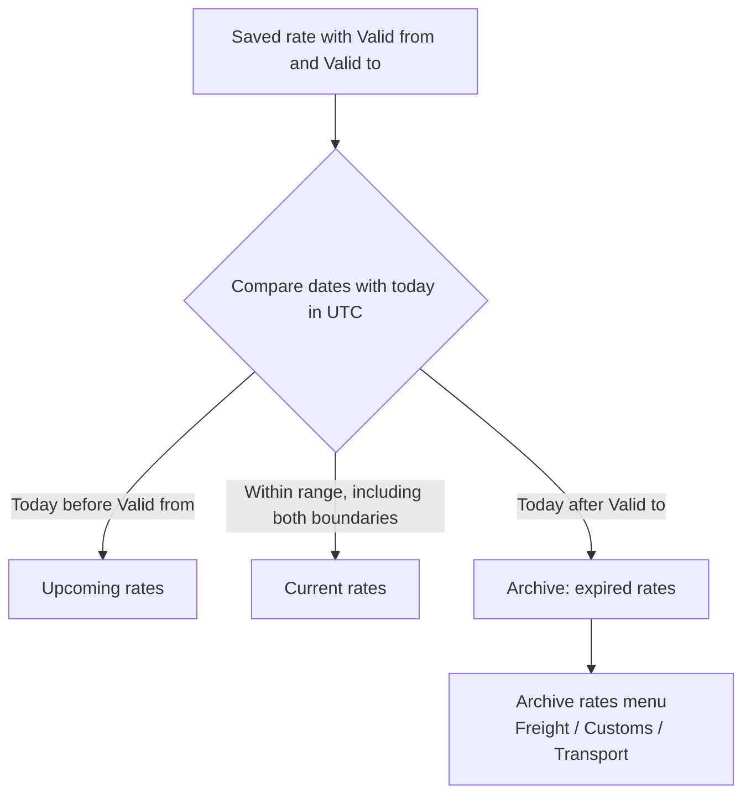
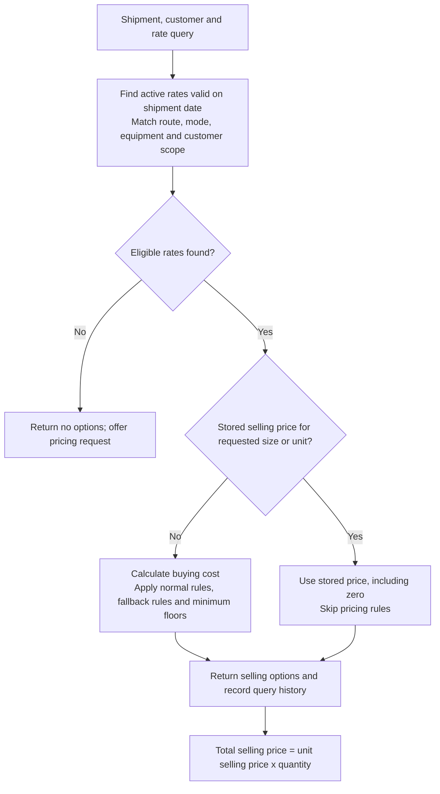
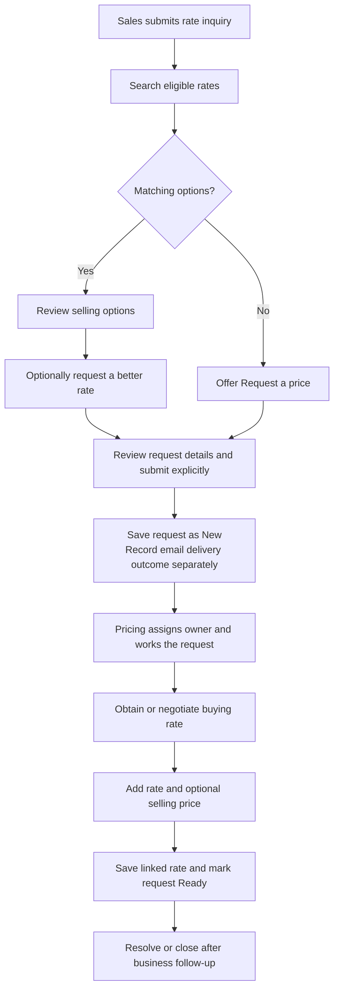

# Freight Pricing — Business Requirements & Workflows

A central workspace for maintaining freight and service buying rates, calculating selling prices, and handling pricing requests.

**Document version:** 2.0 · **Updated:** 26 September 2026  
**Status:** Business review baseline. Implementation status describes source-code capabilities, not production acceptance or confirmed deployment readiness.

This repository contains the React frontend. The backend is a separately hosted .NET API. The target business workflow below follows the supplied Cost Tables → Margin Engine → Price Tables → Salesforce diagram.

## Contents

- [Business purpose](#business-purpose)
- [Scope and responsibilities](#scope-and-responsibilities)
- [Target business workflow](#target-business-workflow)
- [Business requirements](#business-requirements)
- [Rate upload workflow](#rate-upload-workflow)
- [Validity and archive workflow](#validity-and-archive-workflow)
- [Selling-price workflow](#selling-price-workflow)
- [Inquiry and pricing-request workflow](#inquiry-and-pricing-request-workflow)
- [Salesforce and batch publication](#salesforce-and-batch-publication)
- [Frontend navigation](#frontend-navigation)
- [Data and business rules](#data-and-business-rules)
- [Acceptance criteria](#acceptance-criteria)
- [Open decisions and production readiness](#open-decisions-and-production-readiness)
- [Frontend setup and delivery](#frontend-setup-and-delivery)

## Business purpose

The business needs one place to maintain supplier costs, apply consistent pricing policy, retrieve valid selling rates, and retain expired rates for reference. Sales should reuse available prices and ask the pricing team for a new or better rate when needed.

The intended outcomes are fewer duplicate rate entries, clearer validity, consistent margins, traceable customer/RFQ prices, and less manual transfer of prices to Salesforce. Suggested measures are inquiry match rate, time from request creation to Ready, upload rejection rate, and publication success rate. Targets and reporting owners remain to be agreed; there is no KPI dashboard today.

## Scope and responsibilities

| Role | Responsibilities |
| --- | --- |
| Sales requester | Search rates, supply shipment/customer information, request new or better prices |
| Pricing specialist | Upload and maintain costs, set selling prices, own and fulfill pricing requests |
| Pricing manager | Define margin policy, review exceptions, agree validity and publication rules |
| Integration team | Connect source systems and Salesforce; own mappings, schedules and delivery reconciliation |
| Administrator | Manage identity, configuration, secrets, backups and deployments |

These are business roles. Separate internal role permissions and approval chains are not implemented.

**Current scope:** Sea FCL, Sea LCL, Air, Customs, Trucking and Cross-border tariffs; CSV/XLSX upload; manual entry; freight pricing rules; optional stored selling prices; rate inquiry; pricing requests; archive browsing; and a server-to-server selling-rate query API.

**Target extensions:** web/email RPA, AI email ingestion, a persisted calculated-price repository, and scheduled Excel publication through FTP to Salesforce.

Booking, invoicing, automatic FX sourcing, procurement automation and booking-based quota deductions are outside the current implementation.

## Target business workflow

Solid arrows show the core business flow; dashed arrows identify planned automated interfaces. This is a target architecture, not a statement that every box is deployed.



The supplied diagram mentions **S/R** and **C/K**. Their business definitions, calculation order and field mappings require confirmation; this document does not assign them invented meanings.

Today, freight selling prices are calculated during a query or taken from a stored rate price. Quote logs and saved quotation snapshots do not constitute the target scheduled price-table publication service. Pricing rules are maintained separately from cost records.

## Business requirements

| ID | Requirement | Implementation status |
| --- | --- | --- |
| BR-01 | Maintain a central repository of buying rates by service, route, supplier, equipment, currency and validity | Implemented |
| BR-02 | Give each rate an ID; uploaded existing IDs update, blank IDs insert | Implemented across all six upload types |
| BR-03 | Validate uploaded values and show creates/updates before saving | Implemented; atomic batch commit |
| BR-04 | Support manual maintenance and CSV/XLSX uploads | Implemented |
| BR-05 | Ingest rates from web/email RPA and an AI email reader | Planned; connectors and validation contracts required |
| BR-06 | Calculate freight selling prices from costs and pricing rules | Implemented |
| BR-07 | Prefer an explicitly saved selling price over rule calculation | Implemented; zero is an explicit price |
| BR-08 | Separate General prices from customer/opportunity-specific RFQ prices | Implemented |
| BR-09 | Show current, upcoming and expired rates separately without deleting expired records | Implemented; Archive rates menu |
| BR-10 | Allow sales to search rates and explicitly request new or better prices | Implemented |
| BR-11 | Let pricing assign owners, maintain notes and save a linked rate | Implemented |
| BR-12 | Return selling rates to Salesforce without internal buying costs or margins | Query API implemented; consumer setup required |
| BR-13 | Persist calculated publishable prices in price tables | Planned; stored manual prices and query logs already exist |
| BR-14 | Publish an Excel file to FTP every five minutes for Salesforce consumption | Planned; no scheduler, FTP delivery or Salesforce ingestion implemented |
| BR-15 | Retain every prior revision of an edited rate | Not implemented; expired-record archive is available |
| BR-16 | Enforce production SSO and role-based access | Pending |

## Rate upload workflow



### ID and file rules

- **Existing positive ID:** update that existing record in the selected service type. Unknown IDs, zero, negative values and invalid IDs are rejected.
- **Blank or omitted ID:** insert a new record. It never silently updates a record by matching its rate code.
- **Freight:** one charge per row. Repeat the same ID and identical rate details for all charges of an existing tariff. For a new tariff, rows with the same RateCode form one tariff; the RateCode must be unique. Matching charge codes update, and omitted charges remain.
- **Service tariffs:** one charge record per row. Re-uploading a row with a blank ID creates another record. Duplicate existing IDs in a service upload are rejected.
- Missing columns retain existing values on updates. Included blank optional cells clear their values. Required fields cannot be blank.
- Uploads do not delete tariffs or charge lines. Rates linked to pricing requests must be edited through the request workspace.
- CSV and the first worksheet of XLSX are supported, up to 5 MB and 5,000 data rows. Use the template headers. Legacy XLS and arbitrary supplier layouts are not supported.
- Dates accept `yyyy-mm-dd` or Excel date cells. Formula cells are rejected; upload values instead.
- A preview makes no database changes. Its one-use token expires after 30 minutes or an API restart. Stale/conflicting commits reject the whole batch.

## Validity and archive workflow



Archive membership is calculated when records are queried. There is no scheduled move, separate archive copy or automatic deletion. The regular management screens default to Current and also offer Upcoming, Archive and All filters. The dedicated Archive rates menu shows expired records.

Active/inactive is a separate flag. An inactive rate can still fall within the current validity period. Quoting requires an active rate valid for the requested **shipment date**, which can differ from today's management view.

**History limitation:** updating an ID changes that record, including its dates and prices. The archive does not save earlier revisions. To retain the old validity period when introducing a new one, insert a new record with a blank ID and, for freight, a unique RateCode. Extending the old record's dates may remove it from the expired view. Archive screens currently retain edit/delete controls; they are not an immutable audit ledger.

## Selling-price workflow



Normal rules run by ascending priority, with specificity resolving ties. `stopProcessing` can stop normal-rule evaluation. Fallback rules apply when no margin rule matched; minimum-selling-price floors apply last. Supported rule types are Percentage, FixedPerUnit, FlatPerShipment, TargetMargin and MinimumSell.

Sea FCL charges support 20, 40, 40H and 45 size amounts. LCL uses a base amount per cbm and Air per kg. Stored freight selling prices are complete tariff/package unit prices, not per-charge markups. Optional charges and non-markupable costs are supported. Currency is retained; the inquiry does not automatically consolidate currencies or obtain FX rates.

Customs and transport tariffs store their own buying/selling amounts, units and currencies. They are not automatically included in freight inquiry results. A separate backend quotation-composition API can combine freight and service tariffs; a quotation-entry frontend is not implemented.

## Inquiry and pricing-request workflow



Searching alone does not create a pricing request or send email. The requester comes from the current-user identity; request details include customer, opportunity type, estimated volume and notes. Better-rate requests preserve the selected rate and search context.

The queue supports New, In progress, Waiting for rate, Buying rate set, Ready, Resolved and Closed. The diagram is the intended operating sequence, not a fully enforced approval state machine. Saving a linked rate marks the request Ready; changing notes or owner does not change its price or send email. Revision checks reject stale updates.

Email status is separate from work status. Development Demo mode saves requests without sending email. Live SMTP requires server configuration and verified requester identity. Demo requests are not automatically replayed as live messages.

## Salesforce and batch publication

### Available now: selling-rate query API

Salesforce or another trusted server can call:

```http
POST /api/integrations/v1/rates/query
X-Api-Key: <server-side credential>
Content-Type: application/json
```

```json
{
  "recordType": "RFQ",
  "accountId": "C-1001",
  "salesforceOpportunityId": "006XXXXXXXXXXXXXXX",
  "mode": "SeaFcl",
  "destCountry": "SINGAPORE",
  "containerType": "DC",
  "containerSize": "20",
  "quantity": 2,
  "shipmentDate": "2026-09-26"
}
```

The API returns selling options, source rate identifiers, currency, validity, price source and recommendation metadata. It omits internal buying costs and margins. No matches return an empty options list. It does not create Salesforce records, publish files or send pricing requests. Keep integration credentials on the consuming server, never in frontend code or `VITE_*` variables.

### Target: five-minute file publication

The supplied business process requires Excel output to FTP every five minutes and Salesforce consumption. The following are **proposed acceptance requirements**, not current functionality:

1. Select eligible calculated prices and create a versioned publication batch.
2. Export the agreed Excel schema with stable record identifiers and validity.
3. Deliver to the agreed transfer endpoint every five minutes.
4. Have the Salesforce ingestion process acknowledge accepted/rejected rows.
5. Retry failures without creating duplicate Salesforce prices; keep delivery and reconciliation history.
6. Define how changed, expired and withdrawn prices become unavailable downstream.

The integration team must agree full versus incremental export, FTP versus SFTP, credentials, file naming, timezone, cut-off behavior, Salesforce object mapping, retry policy and monitoring ownership before implementation.

## Frontend navigation

| Menu | Route | Main purpose |
| --- | --- | --- |
| Freight tariffs | `/costs` | Maintain Sea FCL, Sea LCL and Air rates; uploads; carrier preferences and quota |
| Customs tariffs | `/customs-pricing` | Maintain customs charge rates and uploads |
| Transport tariffs | `/transport-pricing` | Maintain Trucking and Cross-border charge rates and uploads |
| Archive rates | `/archive-rates` | Open expired freight, customs and transport views |
| Pricing rules | `/rules` | Maintain and test freight markup rules |
| Rate inquiry | `/rate-inquiry` | Search selling rates and request new/better prices |
| Pricing requests | `/pricing-requests` | Assign and fulfill requests; maintain linked rates |

The archive has direct routes `/archive-rates/freight`, `/archive-rates/customs` and `/archive-rates/transport`. `/quote` redirects to Rate inquiry.

## Data and business rules

| Concept | Rule |
| --- | --- |
| Rate ID | System identifier used for uploads and editing within the selected rate type |
| Freight RateCode | Unique business code; required for freight uploads; not a substitute for update ID |
| General / RFQ | RFQ requires account ID and Salesforce opportunity ID; queries respect that scope |
| FAK / NAC | NAC rates require customer ownership; separate classification from General/RFQ |
| Buying versus selling | Stored independently; a blank selling price enables freight rule calculation |
| Validity | Both boundary dates inclusive; expired when ValidTo is before today in UTC |
| Preferred / priority | Up to three distinct eligible preferred carriers recommended per trade lane; lower priority first |
| Quota | Allocation for the tariff validity period; blank is unspecified, zero cannot be recommended; no booking deduction |
| Price source | `Rate` for explicit selling price; `Rules` for calculated price |
| Request-linked rate | Maintained through its pricing request, not ordinary upload edits |
| Archive | Expired records retained in existing storage; not revision history |

## Acceptance criteria

| ID | Scenario | Expected result |
| --- | --- | --- |
| AC-01 | Upload a valid record without ID | Preview shows Create; confirmation inserts a new record |
| AC-02 | Upload a valid existing ID | Preview shows Update; confirmation changes that record, retaining omitted fields/charges |
| AC-03 | Upload unknown ID, wrong service type or existing freight code with blank ID | Reject; do not silently insert or overwrite another record |
| AC-04 | One row is invalid or a record changes after preview | Reject the batch without partial saves |
| AC-05 | Today equals ValidTo | Rate remains Current; appears in Archive the next UTC day |
| AC-06 | ValidFrom is in the future | Rate appears in Upcoming, not Current or Archive |
| AC-07 | Open Archive rates and select a category | Only expired records of that category are listed with IDs and dates |
| AC-08 | Query a stored selling price of zero | Use zero; do not apply margin rules |
| AC-09 | Query with blank selling price | Apply eligible pricing rules and return calculated prices |
| AC-10 | Search returns no matches | Offer a request form; create nothing until explicit submission |
| AC-11 | Pricing saves a valid linked rate | Persist rate and mark request Ready; reject stale revisions |
| AC-12 | Salesforce queries rates | Return selling information without costs/margins; validate integration credential |
| AC-13 | Update an archived rate's validity | Reclassify by resulting dates; do not claim a prior-revision snapshot was saved |
| AC-14 | Run scheduled FTP publication | Planned: verify five-minute delivery, acknowledgment, retries and expiration handling after implementation |

Backend verification includes upload, inquiry, preference and quotation smoke tests in the backend project. Frontend verification uses `npm run build`; production acceptance also requires browser and end-to-end checks against the deployed API.

## Open decisions and production readiness

- Agree the meanings and calculation behavior of S/R and C/K.
- Specify source ingestion contracts, duplicate detection and human review for AI/RPA data.
- Decide whether editing/deleting archived rates should be restricted and whether immutable version history is required.
- Confirm production identity, permissions and any pricing approval chain. Internal APIs currently rely on a trusted-network model; the integration API key does not secure every internal route.
- Configure and verify live email, requester identity, error monitoring and backups.
- Define calculated-price storage, refresh triggers and behavior when rates or rules change.
- Agree Salesforce mappings, file transfer security, publication acknowledgments and retry ownership.
- Confirm production hosting, API CORS origins, SPA deep-link behavior and deployment monitoring.

## Frontend setup and delivery

### Technology

React 19, TypeScript, Vite, React Router, Tailwind CSS v4, shadcn/ui components, Radix primitives and Lucide icons. See [UI implementation notes](UI.md).

```bash
npm ci
npm run dev
npm run build
npm run preview
```

The development server uses port 5173. The production output is `dist/`.

Development uses `/api` from `.env`; the Vite proxy forwards requests to
`http://localhost:5039`. Run the backend separately.

Production builds use `.env.production`, which sets `VITE_API_BASE` to
`https://inet-pricing-ewdbaxeyevdzd4dv.southeastasia-01.azurewebsites.net/api`.
`npm run build` and the Azure Static Web Apps workflow use this production setting.
Rebuild and redeploy `dist/` after changing the API target; it is embedded at build time.

For development overrides, use `.env.development.local`. For a different production
API, use `.env.production.local` or set `VITE_API_BASE` in the build environment.
Build environment variables take precedence over env files. The API's `AllowedOrigins`
configuration must include the deployed frontend's exact HTTPS origin.

### Repository structure

```text
src/
  api/                 API client and shared types
  components/ui/       shadcn/ui components
  components/ui.tsx    Shared Modal, Field, Check and Spinner helpers
  pages/               Tariffs, archive, inquiry, rules and request screens
  lib/                 Formatting and class-name utilities
  App.tsx              Navigation and routes
  index.css            Theme tokens and application layout
components.json        shadcn registry configuration
.github/workflows/     Azure Static Web Apps delivery workflow
```

### GitHub and Azure deployment

The frontend is the root of this Git repository. The workflow builds from `/` and publishes `dist` to Azure Static Web Apps. Pushes to `main` trigger deployment; configured pull-request events also run the workflow. Backend deployment is separate.

Commit **new files as well as modified files**, especially `src/components/ui/`, `src/lib/utils.ts` and `components.json`. A successful local build can hide untracked files that are missing in CI. Review `git status --short` and verify the committed source before pushing. Monitor GitHub Actions for the actual deployment result; a successful push alone does not confirm a live release.
